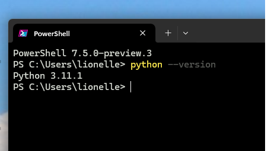
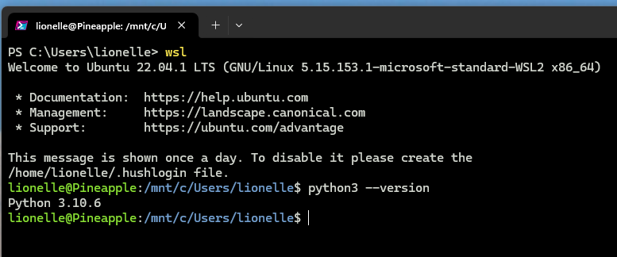

# Required Install

The following tools should be installed, ideally before / during the first week of the course. While we may not use all of them
immediately, never let a tool limit your participation! If you have issues installing, please make sure
to reach out and schedule time during office hours!

- [Required Install](#required-install)
  - [Python](#python)
  - [GIT](#git)
  - [GitHub](#github)
  - [Visual Studio Code](#visual-studio-code)
    - [VS Code Extensions](#vs-code-extensions)
  - [MS Teams](#ms-teams)

## Python
Even if you already have python on your system, you will need to make sure you have least version 3.10 installed. 

[Python Download](https://www.python.org/downloads/). Additionally, for Windows, you can installed Python through the
new windows store if you have Windows 11.  To test to make sure python is installed properly, open your
`Terminal` in windows type `python --version`, in macOS or linux, type `python3 --version`. Suggestion, make sure to restart your computer after installing before you check.

Windows  

Linux/MacOS  

>  [!CAUTION]
>  By default, MacOS has python2.7 installed, and if you type python without the 3, it will
>  report that version. Make sure you have version 3 installed, as there is a very big
>  difference in syntax. 

## GIT

GIT is a version control system that we will use on our homeworks. We don't expect you to be experts in git (or github), but using the basic commands in this course will help prepare you for future courses (and careers) that expect git. 

For MacOS and linux clients, git is (usually) already installed. You are good to go. For windows, you will need to [download git](https://git-scm.com/download/win). 

You can check to make sure git is installed properly by typing in your terminal `git --version`

## GitHub

We will be using github to share assignment templates and instructions. Github is considered
a standard in the industry, and a great place to start building your portfolio. As such, we are asking you to setup a [github.com](https://github.com/). As such, sign up for a Github.com account. We recommend using a professional name that you wouldn't mind sharing with future employers

You can learn more about git and github on the [Resources](Resources.md) page. 

## Visual Studio Code

We will be using [Visual Studio Code](https://code.visualstudio.com/) for a development environment for the course. While VS Code has a fair number of features, we encourage you to keep your environment simple for the beginning of the semester. As you progress you will gain more features. Additionally, after you install VS Code, you will need to install the following extensions. 

### VS Code Extensions

* [Python Support](https://marketplace.visualstudio.com/items?itemName=ms-python.python) - essential
* [Jupyter Notebook Support](https://marketplace.visualstudio.com/items?itemName=ms-toolsai.jupyter) - used for interactive mode
* [Mermaid Markdown Preview](https://marketplace.visualstudio.com/items?itemName=bierner.markdown-mermaid) - makes instructions easier to read locally
* [Markdown Preview Github Styling](https://marketplace.visualstudio.com/items?itemName=bierner.markdown-preview-github-styles) - helps with instructions and report documents.
* [Live Share](https://marketplace.visualstudio.com/items?itemName=MS-vsliveshare.vsliveshare) - students often find this useful for team meetings
* [Markdown All in One](https://marketplace.visualstudio.com/items?itemName=yzhang.markdown-all-in-one)  - completely optional but useful to have

> [!IMPORTANT]
> While it may seem like a lot, many of these tools we will use throughout the semester. 
> The most important stage at this point is getting python working on your computer, and 
> make sure you meet right away with a TA or instructor to ensure your environment is setup.
> For those who are attending residency, we will be confirming it is setup on your laptops.

## MS Teams
While you can access MS Teams through the browser, it is recommend you install the MS Teams application. We use it as the primary means of communication in the course, and it is an industry standard. You can install it by going to  [MS Teams](https://teams.northeastern.edu/) and downloading it. In general, here is the support page for Microsoft Office - https://microsoft365.northeastern.edu/ through Northeastern.